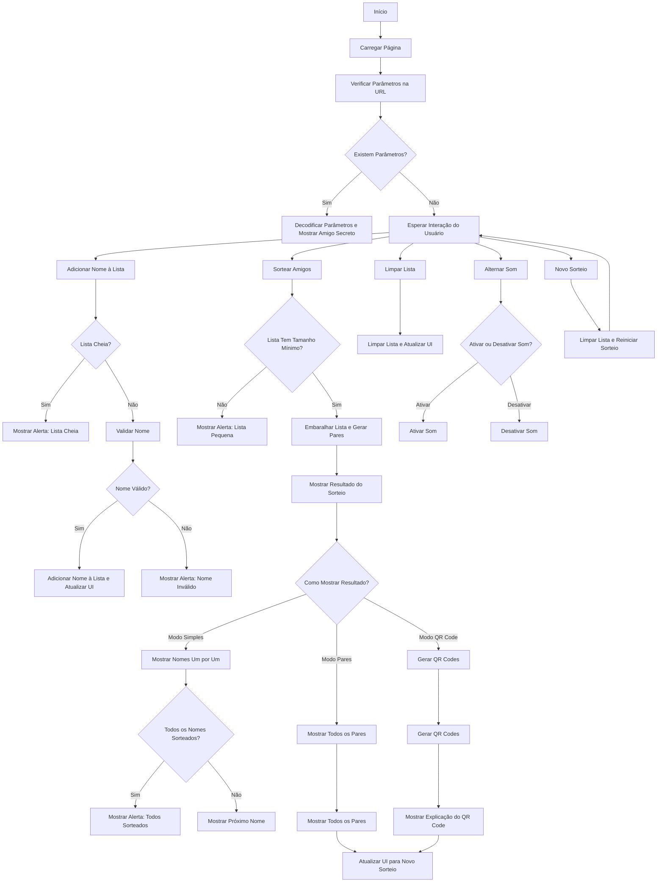
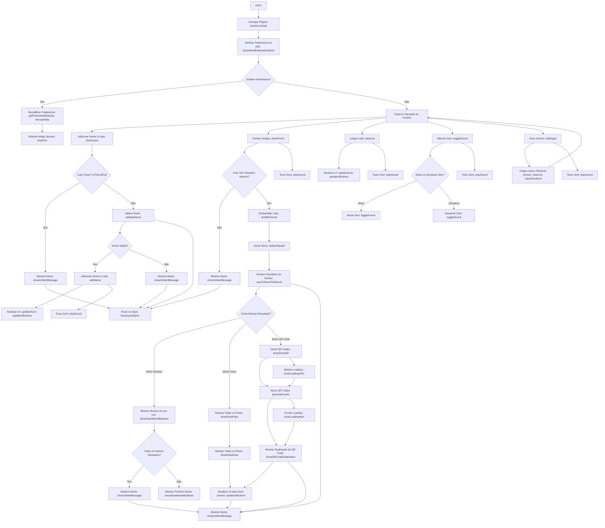

[](https://git.io/typing-svg)

Bem-vindo ao Amigo Secreto, um projeto desenvolvido para facilitar o sorteio de amigos secretos de forma divertida e interativa. Este projeto foi criado por mim (Giulia Armanelli) como parte do desafio do programa <Hello, ONE!> da Oracle Next Education (ONE) ofertada pela Oracle Brasil em parceria com a Alura.

<p align="center">
  <a href="#-tecnologias-utilizadas">🛠 Tecnologias Utilizadas</a>&nbsp;&nbsp;&nbsp;|&nbsp;&nbsp;&nbsp;
  <a href="#-tecnologias-utilizadas">🧠 Como Usar</a>
</p>

## ✨ Visão Geral

O Amigo Secreto é uma aplicação web que permite aos usuários adicionar nomes de amigos, realizar o sorteio de pares e visualizar os resultados de diferentes maneiras. A aplicação oferece três modos de visualização do resultado: Modo Simples, Modo Pares e Modo QR Code, garantindo que o sorteio seja feito de forma justa e sigilosa.

## 🌍 Acesse o Projeto

Você pode acessar o projeto online clicando no link abaixo: 👉🏻 [SÓ CLICAR AQUI](https://juliacomg.github.io/Challenge-Amigo-Secreto-Alura-ONE/) 👈🏻

> EM BREVE VÍDEO COM AS FUNCIONALIDADES

## ✨ Funcionalidades

- **Adicionar Nomes**: Insira os nomes dos participantes do amigo secreto.
- **Remover Nomes**: Permite remover nomes individuais ou limpar toda a lista.
- **Sorteio de Nomes**: Quando há pelo menos 3 nomes na lista, o botão de sorteio é habilitado, permitindo que o usuário realize o sorteio, garantindo que ninguém tire a si mesmo.
- **Efeitos Sonoros**: Adiciona efeitos sonoros interativos durante a digitação e ações na aplicação.
- **Alertas Visuais**: Mensagens de alerta são exibidas para informar o usuário sobre erros, sucessos ou avisos.
- **Visualização dos Resultados:**
  - Modo Simples: Mostra os nomes sorteados um por um.
  - Modo Pares: Exibe todos os pares de amigos secretos de uma vez.
  - Modo QR Code: Gera um QR Code para cada participante, que ao ser escaneado, revela o amigo secreto.
- **Responsividade:** A aplicação é totalmente responsiva, funcionando bem em dispositivos móveis e desktops.

> Para entender mais sobre o funcionamento do site e como o código foi construido veja o [Diagrama de Fluxo](#diagramas-de-fluxo).

## 🛠 Tecnologias Utilizadas

- **HTML5:** Estruturação da página web.
- **CSS3:** Estilização e design responsivo.
- **JavaScript:** Lógica de programação e interatividade.
- **Toastify:** Biblioteca para exibição de alertas personalizados.
- **SweetAlert2:** Biblioteca para modais e caixas de diálogo.
- **QRCode.js:** Biblioteca para geração de QR Codes.

## 🧠 Como Usar

### Pré-requisitos

- Navegador web moderno (Google Chrome, Mozilla Firefox, Safari, etc.).
- Conexão com a internet (para carregar as bibliotecas externas).

### 📋 Instruções

1. [Acesse o site](https://juliacomg.github.io/Challenge-Amigo-Secreto-Alura-ONE/)
OU
Clone o repositório
```
# Via HTTPS:
https://github.com/JuliaComG/Challenge-Amigo-Secreto-Alura-ONE.git

# Via SSH:
git@github.com:JuliaComG/Challenge-Amigo-Secreto-Alura-ONE.git

# Faça download do ZIP do arquivo
https://github.com/JuliaComG/Challenge-Amigo-Secreto-Alura-ONE/archive/refs/heads/main.zip
```
- Entre na pasta do projeto, e execute o arquivo `index.html`
   
2. Adicionar Nomes:
- No campo de texto, digite o nome de um amigo e clique em "Adicionar" ou pressione "Enter".
- Os nomes serão exibidos na lista abaixo do campo de entrada.

3. Realizar o Sorteio:
- Após adicionar pelo menos 3 nomes, o botão "Sortear amigo" será habilitado.
- Clique em "Sortear amigo" para realizar o sorteio.

4. Visualizar Resultados:
- Após o sorteio, você poderá escolher entre três modos de visualização:
- Modo Simples: Mostra os nomes sorteados um por um.
- Modo Pares: Exibe todos os pares de amigos secretos.
- Modo QR Code: Gera um QR Code para cada participante, que ao ser escaneado, revela o amigo secreto.

5. Gerenciar a Lista:
- Para remover um nome individualmente, clique no botão "X" ao lado do nome na lista.
- Para limpar toda a lista, clique no botão "Apagar lista".

6. Efeitos Sonoros:
- A aplicação possui efeitos sonoros que podem ser habilitados ou desabilitados clicando no ícone de som no canto superior esquerdo da tela.


## 📂 Estrutura do Projeto
```
/
├── 📂 assets/ 
│   ├── 📂 qrcodejs/
│   │   ├──  Arquivos Pertinentes a biblioteca QRCode.js
│   ├── 📂 sweetalert2/ 
│   │   ├──  Arquivos Pertinentes a biblioteca SweetAlert2.js
│   ├── 📂 toastify/ 
│   │   ├──  Arquivos Pertinentes a biblioteca Toastify.js
│   ├── 🖼️ Imagens
├── 📂 sounds/ 
│   ├── 🔊 Sons para erro/sucesso/alert
│   ├── 🔊 Sons de teclado
│   ├── 🔊 Sons de UI
├── 📄 README.md
├── 📄 app.js
├── 🖼️ icon_page.png
├── 📄 index.html
├── 🎨 style.css

```

## 🖥️ Contribuição

Contribuições são bem-vindas! Se você deseja contribuir para este projeto, siga os passos abaixo:

1. Faça um fork do repositório.
2. Crie uma branch para sua feature (`git checkout -b feature/nova-feature`).
3. Commit suas mudanças (`git commit -m 'Adicionando nova feature'`).
4. Push para a branch (`git push origin feature/nova-feature`).
5. Abra um Pull Request.

## 🛡️ Licença

Este projeto está sob a licença MIT. Isso significa que você pode utilizá-lo, modificá-lo e distribuí-lo livremente, desde que mantenha os créditos.

## 📧 Contato

Se você tiver alguma dúvida ou sugestão, sinta-se à vontade para entrar em contato:

- Giulia Armanelli
- GitHub: JuliaComG
- Linkdin: https://www.linkedin.com/in/giulia-armanelli/
- Email: garmanelli.dev@gmail.com

## 💖 Créditos e Agradecimentos 

Quero agradecer à [Alura](https://github.com/alura-cursos) e à [Oracle](https://github.com/oracle) pelo conhecimento compartilhado e pelas oportunidades proporcionadas por meio do programa **<Hello, ONE!>**.

## 📃 Certificação

Fui reconhecida com a seguinte insígnia pelo programa <Hello, ONE!> da Alura + Oracle:

<p align="center"></p>

## Diagramas de Fluxo

Abaixo estão os diagramas de fluxo que ilustram o funcionamento do site Amigo Secreto. Eles ajudam a entender como os usuários interagem com a aplicação e como os dados são processados.

<p align="center">
  <a href="#fluxo-principal-do-site---simplicado">Simplificado</a>&nbsp;&nbsp;&nbsp;|&nbsp;&nbsp;&nbsp;
  <a href="#fluxo-detalhado-com-nome-das-funções">Detallhado</a>
</p>

### Fluxo Principal do Site - Simplicado



## Fluxo Detalhado com nome das funções


