# Amigo Secreto - Sorteio de Nomes

Bem-vindo ao Amigo Secreto, um projeto desenvolvido para facilitar o sorteio de amigos secretos de forma divertida e interativa. Este projeto foi criado por mim (Giulia Armanelli) como parte do desafio do programa Alura ONE.

## Visão Geral

O Amigo Secreto é uma aplicação web que permite aos usuários adicionar nomes de amigos, realizar o sorteio de pares e visualizar os resultados de diferentes maneiras. A aplicação oferece três modos de visualização do resultado: Modo Simples, Modo Pares e Modo QR Code, garantindo que o sorteio seja feito de forma justa e sigilosa.

## Funcionalidades

- **Adicionar Nomes**: Insira os nomes dos participantes do amigo secreto.
- **Remover Nomes**: Permite remover nomes individuais ou limpar toda a lista.
- **Sorteio de Nomes**: Quando há pelo menos 3 nomes na lista, o botão de sorteio é habilitado, permitindo que o usuário realize o sorteio, garantindo que ninguém tire a si mesmo.
- **Efeitos Sonoros**: Adiciona efeitos sonoros interativos durante a digitação e ações na aplicação.
- **Alertas Visuais**: Mensagens de alerta são exibidas para informar o usuário sobre erros, sucessos ou avisos.
- **Visualização dos Resultados:**
  - Modo Simples: Mostra os nomes sorteados um por um.
  - Modo Pares: Exibe todos os pares de amigos secretos de uma vez.
  - Modo QR Code: Gera um QR Code para cada participante, que ao ser escaneado, revela o amigo secreto.
- **Responsividade:** A aplicação é totalmente responsiva, funcionando bem em dispositivos móveis e desktops.

## Tecnologias Utilizadas

- **HTML5:** Estruturação da página web.
- **CSS3:** Estilização e design responsivo.
- **JavaScript:** Lógica de programação e interatividade.
- **Toastify:** Biblioteca para exibição de alertas personalizados.
- **SweetAlert2:** Biblioteca para modais e caixas de diálogo.
- **QRCode.js:** Biblioteca para geração de QR Codes.

## Como Usar

### Pré-requisitos

- Navegador web moderno (Google Chrome, Mozilla Firefox, Safari, etc.).
- Conexão com a internet (para carregar as bibliotecas externas).

### Instruções

1. Adicionar Nomes:
- No campo de texto, digite o nome de um amigo e clique em "Adicionar" ou pressione "Enter".
- Os nomes serão exibidos na lista abaixo do campo de entrada.

2. Realizar o Sorteio:
- Após adicionar pelo menos 3 nomes, o botão "Sortear amigo" será habilitado.
- Clique em "Sortear amigo" para realizar o sorteio.

3. Visualizar Resultados:
- Após o sorteio, você poderá escolher entre três modos de visualização:
- Modo Simples: Mostra os nomes sorteados um por um.
- Modo Pares: Exibe todos os pares de amigos secretos.
- Modo QR Code: Gera um QR Code para cada participante, que ao ser escaneado, revela o amigo secreto.

4. Gerenciar a Lista:
- Para remover um nome individualmente, clique no botão "X" ao lado do nome na lista.
- Para limpar toda a lista, clique no botão "Apagar lista".

5. Efeitos Sonoros:
- A aplicação possui efeitos sonoros que podem ser habilitados ou desabilitados clicando no ícone de som no canto superior esquerdo da tela.


## 📂 Estrutura do Projeto
```
/
├── 📂 assets/ 
│   ├── 📂 qrcodejs/
│   │   ├──  Arquivos Pertinentes a biblioteca QRCode.js
│   ├── 📂 sweetalert2/ 
│   │   ├──  Arquivos Pertinentes a biblioteca SweetAlert2.js
│   ├── 📂 toastify/ 
│   │   ├──  Arquivos Pertinentes a biblioteca Toastify.js
│   ├── 🖼️ Imagens
├── 📂 sounds/ 
│   ├── 🔊 Sons para erro/sucesso/alert
│   ├── 🔊 Sons de teclado
│   ├── 🔊 Sons de UI
├── 📄 README.md
├── 📄 app.js
├── 🖼️ icon_page.png
├── 📄 index.html
├── 🎨 style.css

```

## Contribuição

Contribuições são bem-vindas! Se você deseja contribuir para este projeto, siga os passos abaixo:

1. Faça um fork do repositório.
2. Crie uma branch para sua feature (`git checkout -b feature/nova-feature`).
3. Commit suas mudanças (`git commit -m 'Adicionando nova feature'`).
4. Push para a branch (`git push origin feature/nova-feature`).
5. Abra um Pull Request.

## Licença

Este projeto está licenciado sob a licença MIT. Veja o arquivo LICENSE para mais detalhes.

## Contato

Se você tiver alguma dúvida ou sugestão, sinta-se à vontade para entrar em contato:

- Giulia Armanelli
- GitHub: JuliaComG
- Linkdin: https://www.linkedin.com/in/giulia-armanelli/
- Email: garmanelli.dev@gmail.com

## Diagramas de Fluxo

Abaixo estão os diagramas de fluxo que ilustram o funcionamento do site Amigo Secreto. Eles ajudam a entender como os usuários interagem com a aplicação e como os dados são processados.

### Fluxo Principal do Site - Simplicado

```mermaid
flowchart TD
    A[Início] --> B[Carregar Página]
    B --> C[Verificar Parâmetros na URL]
    C --> D{Existem Parâmetros?}
    D -- Sim --> E[Decodificar Parâmetros e Mostrar Amigo Secreto]
    D -- Não --> F[Esperar Interação do Usuário]

    F --> G[Adicionar Nome à Lista]
    G --> H{Lista Cheia?}
    H -- Sim --> I[Mostrar Alerta: Lista Cheia]
    H -- Não --> J[Validar Nome]
    J --> K{Nome Válido?}
    K -- Sim --> L[Adicionar Nome à Lista e Atualizar UI]
    K -- Não --> M[Mostrar Alerta: Nome Inválido]

    F --> N[Sortear Amigos]
    N --> O{Lista Tem Tamanho Mínimo?}
    O -- Não --> P[Mostrar Alerta: Lista Pequena]
    O -- Sim --> Q[Embaralhar Lista e Gerar Pares]
    Q --> R[Mostrar Resultado do Sorteio]
    R --> S{Como Mostrar Resultado?}
    S -- Modo Simples --> T[Mostrar Nomes Um por Um]
    S -- Modo Pares --> U[Mostrar Todos os Pares]
    S -- Modo QR Code --> V[Gerar QR Codes]

    F --> W[Limpar Lista]
    W --> X[Limpar Lista e Atualizar UI]

    F --> Y[Alternar Som]
    Y --> Z{Ativar ou Desativar Som?}
    Z -- Ativar --> AA[Ativar Som]
    Z -- Desativar --> AB[Desativar Som]

    F --> AC[Novo Sorteio]
    AC --> AD[Limpar Lista e Reiniciar Sorteio]
    AD --> F

    T --> AE{Todos os Nomes Sorteados?}
    AE -- Sim --> AF[Mostrar Alerta: Todos Sorteados]
    AE -- Não --> AG[Mostrar Próximo Nome]

    U --> AH[Mostrar Todos os Pares]
    AH --> AI[Atualizar UI para Novo Sorteio]

    V --> AJ[Gerar QR Codes]
    AJ --> AK[Mostrar Explicação do QR Code]
    AK --> AI
```



## Fluxo Detalhado com nome das funções

```mermaid
flowchart TD
    A[Início] --> B[Carregar Página: window.onload]
    B --> C[Verificar Parâmetros na URL: showAlertIfParametersExist]
    C --> D{Existem Parâmetros?}
    D -- Sim --> E[Decodificar Parâmetros: getParameterByName, decryptData]
    E --> F[Mostrar Amigo Secreto: Swal.fire]
    D -- Não --> G[Esperar Interação do Usuário]

    G --> H[Adicionar Nome à Lista: checkInput]
    H --> I{Lista Cheia? isTheListFull}
    I -- Sim --> J[Mostrar Alerta: showUIAlertMessage]
    I -- Não --> K[Validar Nome: validateName]
    K --> L{Nome Válido?}
    L -- Sim --> M[Adicionar Nome à Lista: addName]
    M --> N[Atualizar UI: updateUIList, updateUIButtons]
    L -- Não --> O[Mostrar Alerta: showUIAlertMessage]

    G --> P[Sortear Amigos: drawFriend]
    P --> Q{Lista Tem Tamanho Mínimo?}
    Q -- Não --> R[Mostrar Alerta: showUIAlertMessage]
    Q -- Sim --> S[Embaralhar Lista: shuffleFriends]
    S --> T[Gerar Pares: didIGetMyself]
    T --> U[Mostrar Resultado do Sorteio: wayToShowTheResult]
    U --> V{Como Mostrar Resultado?}
    V -- Modo Simples --> W[Mostrar Nomes Um por Um: showDrawNameByName]
    V -- Modo Pares --> X[Mostrar Todos os Pares: showDrawPairs]
    V -- Modo QR Code --> Y[Gerar QR Codes: showDrawQR]

    G --> Z[Limpar Lista: clearList]
    Z --> AA[Atualizar UI: updateUIList, updateUIButtons]

    G --> AB[Alternar Som: toggleSound]
    AB --> AC{Ativar ou Desativar Som?}
    AC -- Ativar --> AD[Ativar Som: toggleSound]
    AC -- Desativar --> AE[Desativar Som: toggleSound]

    G --> AF[Novo Sorteio: doItAgain]
    AF --> AG[Limpar Lista e Reiniciar Sorteio: clearList, clearResultList]
    AG --> G

    W --> AH{Todos os Nomes Sorteados?}
    AH -- Sim --> AI[Mostrar Alerta: showUIAlertMessage]
    AH -- Não --> AJ[Mostrar Próximo Nome: showDrawNameByName]

    X --> AK[Mostrar Todos os Pares: showDrawPairs]
    AK --> AL[Atualizar UI para Novo Sorteio: updateUIButtons]

    Y --> AM[Gerar QR Codes: generateCards]
    AM --> AN[Mostrar Explicação do QR Code: showQRCodeExplanation]
    AN --> AL

    Y --> AO[Mostrar Loading: showLoadingAlert]
    AO --> AM
    AM --> AP[Fechar Loading: closeLoadingAlert]
    AP --> AN

    M --> AQ[Tocar Som: playSound]
    Z --> AR[Tocar Som: playSound]
    AB --> AS[Tocar Som: playSound]
    P --> AT[Tocar Som: playSound]
    AF --> AU[Tocar Som: playSound]

    K --> AV[Focar no Input: focusInputName]
    O --> AV
    R --> AV
    J --> AV

    U --> AW[Mostrar Alerta: showUIAlertMessage]
    AI --> AW
    AL --> AW
    AN --> AW
```


